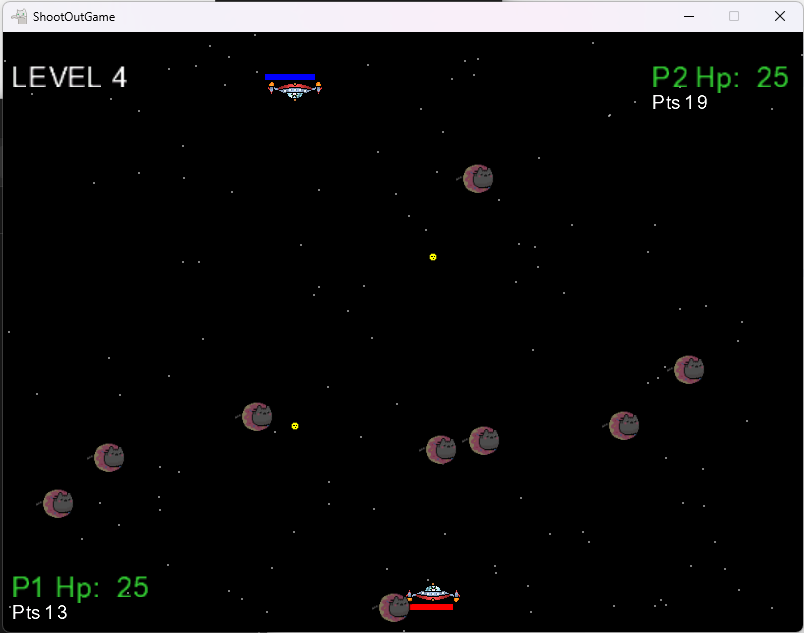
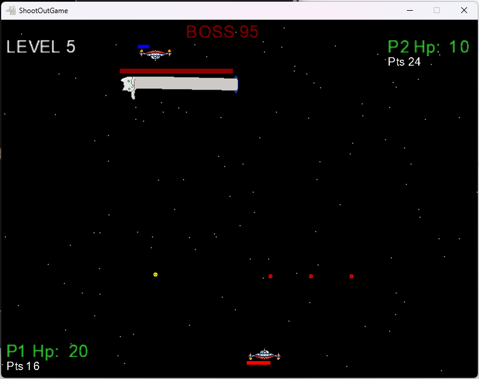

# Monogame-SpaceCats

### Description
A very short, simply and very buggy 2D arcade-style game in C# using the MonoGame (Microsoft.Xna.Framework) framework, 
implementing real-time game loops, keyboard input handling, sprite rendering, 
collision detection, basic AI (boss behavior), and object-oriented game architecture.

### Game screenshots

